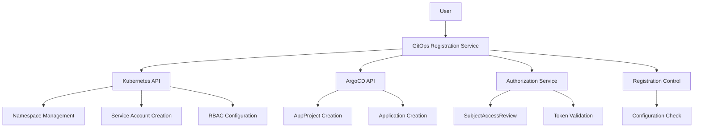

# GitOps Registration Service

A Knative-based service for automated registration and lifecycle management of GitOps repositories in Konflux-CI, implementing secure GitOps workflows with ArgoCD integration and configurable resource restrictions.

## Overview

This service implements the GitOps Registration Service as outlined in [ADR 47: GitOps Onboarding Redesign](https://raw.githubusercontent.com/konflux-ci/architecture/d91958f414e7b7cc5293bbbbe33cad9ad7552991/ADR/0047-gitops-onboarding-redesign.md). It provides:

- **Secure GitOps**: 1:1 mapping between GitOps repositories and Kubernetes namespaces
- **ArgoCD Integration**: Automated AppProject and Application creation for continuous deployment
- **Resource Restrictions**: Configurable allow/deny lists for controlling which Kubernetes resources can be synced
- **Authorization Enforcement**: RBAC-based validation using SubjectAccessReview API (FR-008)
- **Registration Control**: Simple configuration to enable/disable new namespace registrations
- **Namespace Isolation**: Strict security boundaries using service account impersonation

## Key Features

### ✅ Core Functionality
- [x] Repository registration and lifecycle management
- [x] Namespace provisioning with secure isolation
- [x] ArgoCD AppProject and Application configuration
- [x] Resource sync restrictions with allow/deny lists
- [x] RESTful API with OpenAPI 3.0 specification
- [x] Health checks and metrics endpoints

### ✅ FR-008: Existing Namespace GitOps Conversion
- [x] Users with `konflux-admin-user-actions` role can register existing namespaces
- [x] SubjectAccessReview validation ensures proper authorization
- [x] Cross-namespace security enforcement
- [x] Comprehensive audit logging

### ✅ Registration Control
- [x] Simple on/off configuration for new namespace registrations
- [x] Immediate response without complex calculations
- [x] Integration with external capacity management tools
- [x] Service unavailable response when registrations are disabled

### ✅ Security & Compliance
- [x] Configurable resource type restrictions via allow/deny lists
- [x] Service account impersonation for namespace operations
- [x] RBAC-based access control
- [x] Event logging for audit trails

## Quick Start - Integration Testing

The easiest way to test the complete GitOps registration service is to use the integrated make targets:

```bash
# Run complete integration tests from scratch (recommended)
make test-integration-full

# Show all available make targets
make help

# Set up development environment only
make dev-setup

# Quick test (assumes environment exists)
make quick-test

# Clean up everything
make clean-all
```

The `test-integration-full` target will:
1. ✅ Create a single-node KIND cluster
2. ✅ Install Knative, ArgoCD, and Gitea
3. ✅ Set up git repositories with GitOps manifests  
4. ✅ Build and deploy the registration service
5. ✅ Run comprehensive integration tests
6. ✅ Verify actual GitOps sync and deployment

### Prerequisites for Integration Testing

- [KIND](https://kind.sigs.k8s.io/docs/user/quick-start/) 
- [kubectl](https://kubernetes.io/docs/tasks/tools/)
- [Docker](https://docs.docker.com/get-docker/) or [Podman](https://podman.io/getting-started/installation)
- Go 1.21+

### Example Integration Test Output

```bash
$ make test-integration-full
==========================================
GitOps Registration Service - Full Integration Test
==========================================
[INFO] Setting up integration test environment...
[SUCCESS] KIND cluster created successfully!
[SUCCESS] Knative installed and ready
[SUCCESS] ArgoCD installed and ready  
[SUCCESS] Gitea installed with test repositories
[INFO] Deploying GitOps registration service...
[SUCCESS] Service deployed successfully!
[INFO] Running enhanced integration tests...
[SUCCESS] ✓ GET /health/live returned 200 as expected
[SUCCESS] ✓ POST /api/v1/registrations returned 201 as expected
[SUCCESS] ✓ Namespace team-alpha was created
[SUCCESS] ✓ ArgoCD Application team-alpha-app was created
[SUCCESS] ✓ ArgoCD sync status: Synced, Health: Healthy
[SUCCESS] ✓ Real workloads deployed: 2/2 pods running
==========================================
✅ Integration tests completed successfully!
==========================================
```

## Architecture



## Quick Start

### Prerequisites

- **Go 1.21+**
- **kind** (for local testing)
- **kubectl**
- **podman** (for container builds on macOS)

### Local Development

1. **Clone and build**:
   ```bash
   git clone <repository-url>
   cd gitops-registration-service
   go mod tidy
   go build -o bin/gitops-registration-service cmd/server/main.go
   ```

2. **Run locally**:
   ```bash
   ./bin/gitops-registration-service
   ```

3. **Test health endpoints**:
   ```bash
   curl http://localhost:8080/health/live
   curl http://localhost:8080/health/ready
   ```

### Integration Testing

The service includes comprehensive integration tests that run in a Kind cluster with Knative and ArgoCD.

1. **Setup test environment**:
   ```bash
   ./test/integration/setup-test-env.sh
   ```
   
   This script will:
   - Create a Kind cluster with 3 nodes
   - Install Knative Serving with Kourier networking
   - Install ArgoCD with NodePort access
   - Deploy the GitOps Registration Service
   - Configure test users and namespaces for authorization testing
   - Build and load the service image using podman

2. **Run integration tests**:
   ```bash
   cd test/integration
   ./run-tests.sh
   ```
   
   The test suite validates:
   - Health endpoints functionality
   - Registration control (enable/disable)
   - Basic registration workflows
   - Existing namespace authorization (FR-008)
   - Error handling and edge cases
   - Metrics endpoint

3. **Cleanup**:
   ```bash
   kind delete cluster --name gitops-registration-test
   ```

## API Reference

### Core Endpoints

#### Registration Management
```http
POST   /api/v1/registrations              # Create new GitOps registration
GET    /api/v1/registrations              # List all registrations
GET    /api/v1/registrations/{id}         # Get registration details
DELETE /api/v1/registrations/{id}         # Delete registration
GET    /api/v1/registrations/{id}/status  # Get registration status
POST   /api/v1/registrations/{id}/sync    # Trigger sync
```

#### Existing Namespace Registration (FR-008)
```http
POST   /api/v1/registrations/existing     # Register existing namespace
```

#### Health & Monitoring
```http
GET    /health/live                       # Liveness probe
GET    /health/ready                      # Readiness probe
GET    /metrics                           # Prometheus metrics
```

### Example Usage

#### Register New GitOps Repository
```bash
curl -X POST http://localhost:8080/api/v1/registrations \
  -H "Content-Type: application/json" \
  -H "Authorization: Bearer $TOKEN" \
  -d '{
    "repository": {
      "url": "https://github.com/team/config",
      "branch": "main"
    },
    "namespace": "team-production"
  }'
```

#### Register Existing Namespace (FR-008)
```bash
curl -X POST http://localhost:8080/api/v1/registrations/existing \
  -H "Content-Type: application/json" \
  -H "Authorization: Bearer $TOKEN" \
  -d '{
    "repository": {
      "url": "https://github.com/team/existing-config",
      "branch": "main"
    },
    "existingNamespace": "existing-team-namespace"
  }'
```

**Note**: If new registrations are disabled, this will return:
```json
{
  "error": "REGISTRATION_DISABLED",
  "message": "New namespace registrations are currently disabled"
}
```
With HTTP status `503 Service Unavailable`.

## Resource Restrictions

The service supports configurable resource restrictions to control which Kubernetes resource types can be synced by ArgoCD. This is implemented using ArgoCD AppProject's built-in whitelist/blacklist functionality.

**Important**: Resource restrictions are configured at the **service level** by cluster administrators, not by individual users making registration requests. All AppProjects created by the service will use the same resource restrictions.

### Service Configuration

Cluster administrators configure resource restrictions in the service configuration file or via environment variables:

#### Configuration File Example (config.yaml)
```yaml
security:
  # Cluster admin can provide EITHER allowList OR denyList, not both
  
  # Allow List (Whitelist) - only these resources can be synced
  resourceAllowList:
    - group: ""
      kind: "ConfigMap"
    - group: ""
      kind: "Service"
    - group: "apps"
      kind: "Deployment"
    - group: "networking.k8s.io"
      kind: "Ingress"
  
  # OR Deny List (Blacklist) - all resources except these can be synced
  # resourceDenyList:
  #   - group: ""
  #     kind: "Secret"
  #   - group: "rbac.authorization.k8s.io"
  #     kind: "RoleBinding"
  #   - group: "kafka.strimzi.io"
  #     kind: "KafkaTopic"
```

### Allow List (Whitelist)
When an `resourceAllowList` is configured, **only** the specified resource types can be synced. All other resources will be blocked.

### Deny List (Blacklist)
When a `resourceDenyList` is configured, **all** resource types can be synced **except** those specified in the list.

### Default Behavior
If neither `resourceAllowList` nor `resourceDenyList` is configured, all resource types are allowed (no restrictions).

### Validation Rules
- **Mutually Exclusive**: Service can be configured with either `resourceAllowList` OR `resourceDenyList`, but not both
- **Service-wide**: All AppProjects created by the service use the same restrictions
- **CRD Support**: Custom Resource Definitions are supported without validation
- **Group Field**: 
  - Empty string `""` for core Kubernetes resources (Pod, Service, ConfigMap, etc.)
  - API group name for other resources (e.g., `"apps"`, `"networking.k8s.io"`)
- **Admin Control**: Only cluster administrators can modify these restrictions

### Resource Type Examples

| Resource | Group | Kind |
|----------|-------|------|
| ConfigMap | `""` | `"ConfigMap"` |
| Service | `""` | `"Service"` |
| Secret | `""` | `"Secret"` |
| Deployment | `"apps"` | `"Deployment"` |
| Ingress | `"networking.k8s.io"` | `"Ingress"` |
| Custom Resource | `"mycompany.io"` | `"MyCustomResource"` |

## Configuration

The service is configured through environment variables and/or YAML configuration files:

### Environment Variables
- `PORT` - HTTP server port (default: 8080)
- `CONFIG_PATH` - Path to YAML configuration file
- `ARGOCD_SERVER` - ArgoCD server endpoint
- `ARGOCD_NAMESPACE` - ArgoCD namespace (default: argocd)
- `ALLOWED_RESOURCE_TYPES` - Comma-separated list of allowed resource types
- `ALLOW_NEW_NAMESPACES` - Enable new namespace registrations (default: true)
- `AUTHORIZATION_REQUIRED_ROLE` - Required role for existing namespace registration

### YAML Configuration Example
```yaml
server:
  port: 8080
  timeout: 30s

argocd:
  server: "argocd-server.argocd.svc.cluster.local"
  namespace: "argocd"
  grpc: true

security:
  allowedResourceTypes:
  - jobs
  - cronjobs
  - secrets
  - rolebindings

registration:
  allowNewNamespaces: true
  
authorization:
  requiredRole: "konflux-admin-user-actions"
  enableSubjectAccessReview: true
  auditFailedAttempts: true
```

### Registration Control

The service supports simple on/off control for new namespace registrations:

- **Enabled** (default): New namespace registrations are accepted and processed
- **Disabled**: New namespace registrations return HTTP 503 with "REGISTRATION_DISABLED" error

This allows external capacity management tools to control when new registrations are accepted without requiring complex built-in capacity calculations.

To disable new registrations:
```bash
# Environment variable
export ALLOW_NEW_NAMESPACES=false

# Or in YAML config
registration:
  allowNewNamespaces: false
```

## Deployment

### Kubernetes Deployment

1. **Apply RBAC configuration**:
   ```bash
   kubectl apply -f deploy/rbac.yaml
   ```

2. **Deploy Knative service**:
   ```bash
   kubectl apply -f deploy/knative-service.yaml
   ```

3. **Verify deployment**:
   ```bash
   kubectl get ksvc -n konflux-gitops
   ```

### Container Image

Build and push container image:

```bash
# Build with podman (optimized for macOS)
podman build -t gitops-registration-service:latest .

# Save for Kind (macOS TAR approach)
podman save gitops-registration-service:latest -o gitops-registration-service.tar

# Load into Kind cluster  
kind load image-archive gitops-registration-service.tar --name <cluster-name>
```

## Security Considerations

### RBAC Requirements

The service requires cluster-level permissions for:
- Namespace management (create, list, update, delete)
- Service account and RBAC management
- ArgoCD AppProject and Application management
- SubjectAccessReview for authorization validation

### Resource Constraints

- Configurable resource type restrictions via allow/deny lists
- Service account impersonation prevents privilege escalation
- Namespace-scoped permissions for GitOps operations
- ArgoCD AppProject-based resource filtering

### Authorization Flow (FR-008)

1. Extract Bearer token from request Authorization header
2. Validate token using TokenReview API
3. Perform SubjectAccessReview to verify user permissions on target namespace
4. Check specific permissions required by `konflux-admin-user-actions` role
5. Audit all authorization attempts with user identity and result

## Monitoring & Observability

### Prometheus Metrics

- `gitops_registrations_total` - Total number of registrations by status
- `gitops_registration_duration_seconds` - Time taken for registration operations
- `argocd_operations_total` - ArgoCD operations performed
- `registration_disabled_requests_total` - Number of requests rejected due to disabled registrations

### Health Checks

- **Liveness**: `/health/live` - Basic service health
- **Readiness**: `/health/ready` - Dependency availability (Kubernetes API, ArgoCD)

### Logging

Structured JSON logging with correlation IDs for request tracing. All authorization attempts are logged with user identity for audit purposes.

## Development

### Project Structure

```
├── cmd/server/              # Main application entry point
├── internal/
│   ├── config/             # Configuration management
│   ├── handlers/           # HTTP handlers
│   ├── server/             # HTTP server setup
│   ├── services/           # Business logic services
│   └── types/              # Data structures
├── deploy/                 # Kubernetes manifests
├── test/integration/       # Integration tests
├── Dockerfile             # Container image definition
└── README.md              # This file
```

### Testing Strategy

- **Unit Tests**: Service-level testing with mocked dependencies
- **Integration Tests**: Full workflow testing in Kind cluster
- **Security Tests**: Authorization and RBAC validation
- **Registration Control Tests**: Enable/disable functionality

### Adding New Features

1. Update types in `internal/types/`
2. Implement service logic in `internal/services/`
3. Add HTTP handlers in `internal/handlers/`
4. Update OpenAPI specification
5. Add integration tests
6. Update documentation

## Contributing

1. Fork the repository
2. Create a feature branch
3. Make changes with tests
4. Run integration test suite
5. Submit pull request

## License

This project is part of the Konflux-CI ecosystem and follows the same licensing terms.

## Support

For issues and questions:
- Check existing issues in the repository
- Review the technical requirements document
- Run integration tests to verify functionality
- Check ArgoCD and Kubernetes logs for troubleshooting 